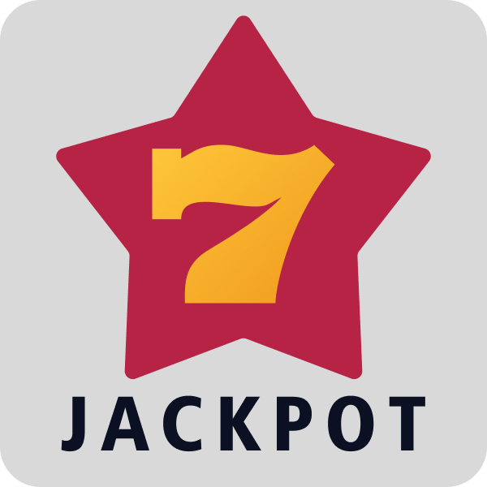
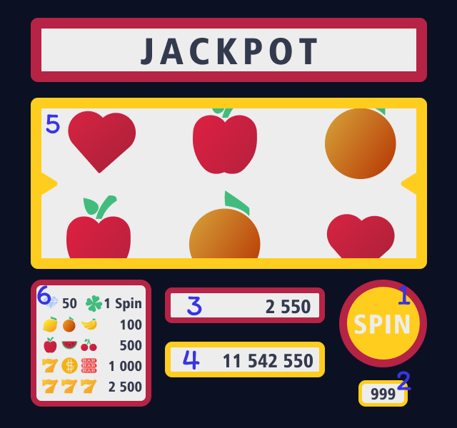

<h1 align="center">
  <br>
  
  <br>
</h1>

<h4 align="center">Un jeux de jackpot pour pc Windows. </h4>

<p align="center">
  <a href="https://www.libsdl.org/">
    
  </a>
  
  
</p>

<p align="center">
  <a href="#Jeux">Jeux</a> •
  <a href="#Telecharger">Télécharger</a> •
  <a href="#Mode_emploi">Mode d’emploi</a> •
  <a href="#credits">Crédits</a>
</p>

<!--  quand il y aura un gif montrant une partie -->

## Jeux

Le but du jeu Jackpot qui est une machine a sous est de faire correspondre les symboles sur les rouleaux de la machine afin de créer une combinaison gagnante. Si vous parvenez à obtenir une combinaison gagnante, vous remporterez des points. Le nombre de points que vous recevrez dépend de la combinaison gagnante que vous avez réalisée.

## Telecharger

- Télécharger Jackpot à partir de Git

```bash
# Clone le dossier
$ git clone https://github.com/xen0r-star/Jackpot

# Allez dans le dossier
$ cd Jackpot
```
> **Note**
> La commande `git clone` de [Git](https://git-scm.com/) permet de créer une copie exacte d'un dépôt Git sur votre ordinateur. Elle est souvent utilisée pour télécharger des projets open source.

<br>

- Télécharger Jackpot à partir du zip

Vous pouvez télécharger Jackpot en utilisant le [fichier zip](https://github.com/xen0r-star/Jackpot/archive/refs/heads/main.zip). Pour cela, il vous suffit simplement de décompresser le fichier. Cela vous permettra d'accéder au contenu du jeu et de l'utiliser sur votre ordinateur.

## Mode_emploi

Pour lancer le jeux il vous suffit juste de lancer le fichier `Jackpor.exe`. Le dossier du jeux est organiser de telle sort a se qu'il est : 

  `/Jackpot.exe` Pour lancer le jeux <br>
  `/Donne/` Endroit ou son stocké les donnée du jeux <br>
  `/code_source/` tout le code du jeux Jackpot <br>

  <h1 align="right">
    <br>
      
  </h1>

  1. `Spin` Pour lancer les une partie
  2. `Spin restant` Nombre de spin qu'il vous reste. Vous en avez 10. Lorsqu'il est a 0 il remets le score a 0 est remets les spin a 10
  3. `Score` Votre score vous gagner des point en fessant des combinaisons
  4. `Meilleur score` Meilleur score que vous avez fait
  5. `Rouleaux` Endroit ou il y a les symbole
  6. `Combinaison` Les combinaisons / symbole a faire pour gagner des point ou spin

## Credits

Jackpot utilise la bibliothèque libre SDL2

- [SDL2](https://www.libsdl.org/)

---

GitHub [@xen0r-star](https://github.com/xen0r-star) &nbsp;&middot;&nbsp;
Twitter [@xen0r_star](https://twitter.com/xen0r_star)
