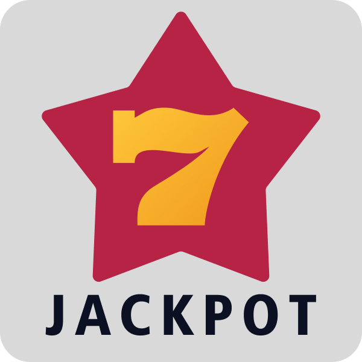
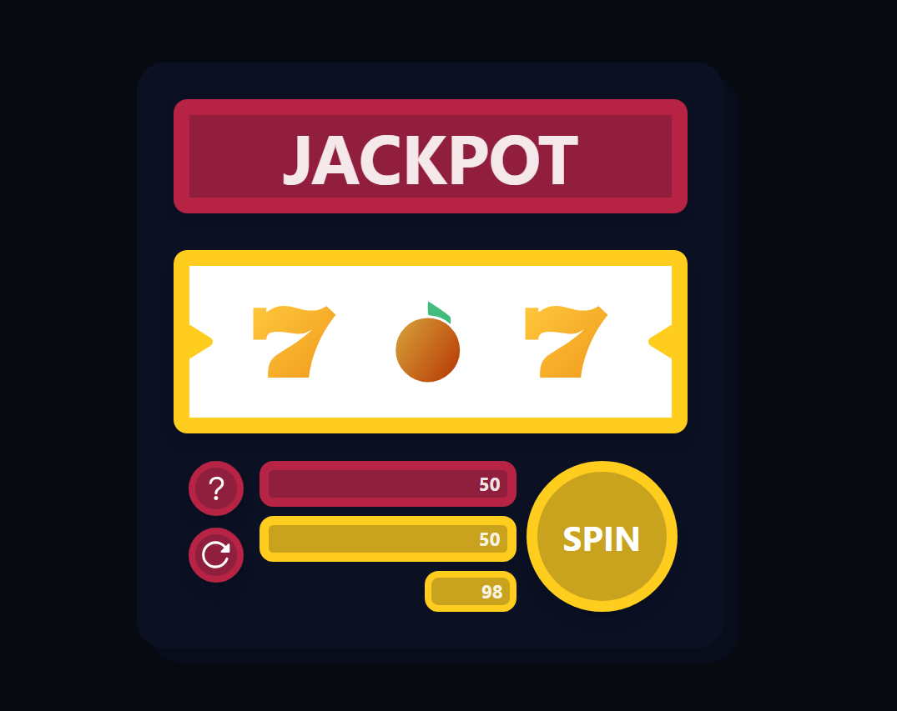
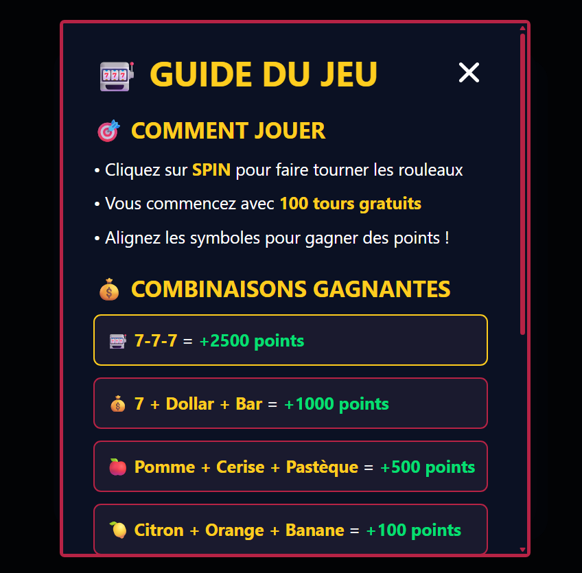

<div align="center">

# 🎰 Jackpot



### Modern slot machine developed in React with TypeScript

[](https://reactjs.org/)
[](https://www.typescriptlang.org/)
[](https://vitejs.dev/)
[](https://tailwindcss.com/)

[](LICENSE)
[](https://github.com/xen0r-star/Jackpot/stargazers)
[](https://github.com/xen0r-star/Jackpot/network/members)

[🎮 Play Online](#) • [📖 Documentation](#features) • [🐛 Report Bug](https://github.com/xen0r-star/Jackpot/issues)

</div>

---

## 🎯 Overview

**Jackpot** is a modern and interactive slot machine that recreates the authentic casino experience directly in your browser. Developed with the latest web technologies, it offers a smooth gaming experience, spectacular animations, and an advanced scoring system.

### 🖼️ Screenshots
<!-- Images in table with description -->
<table>
    <tr>
        <td align="center">
            
            <br>
            <em>Main game interface</em>
        </td>
        <td align="center">
            
            <br>
            <em>Help popup with combinations</em>
        </td>
    </tr>
</table>


## ✨ Features

### 🎰 **Gameplay**
- **3 animated reels** with realistic spinning effects
- **13 unique symbols**: 7, fruits, cards, diamonds, clovers, ...
- **Multiple combinations**: triples, thematic mixes, special symbols
- **100 spins** per game with bonus system

### 🏆 **Scoring System**
- **Animated notifications** for wins (+100, +500, +2500...)
- **Persistent high score** between sessions
- **Dynamic calculation** of points based on combinations

### 🎊 **Visual Effects**
- **Multicolored confetti** on wins
- **Grandiose JACKPOT animation** for triple 777
- **Shine effects** and pulsations on UI elements
- **Custom scrollbar** with theme colors

### 🎮 **User Interface**
- **Responsive design** adapted to all screens
- **Interactive help popup** with all combinations
- **Reset button** to restart a game
- **Elegant dark theme** with gold and red accents

### ⚡ **Performance**
- **Modular architecture** with custom hooks and separated components
- **TypeScript** for type safety
- **React optimizations** (useCallback, useEffect, refs)

---

## 🎲 Winning Combinations

| Combination | Symbols | Points | Description |
|-------------|----------|--------|-------------|
| 🎯 **JACKPOT** | 7️⃣-7️⃣-7️⃣ | **2500** | Triple seven - Special animation! |
| 💎 **Premium Mix** | 7️⃣-💲-📊 | **1000** | Premium mix or triple |
| 🍎 **Fruit Mix** | 🍎-🍒-🍉 | **500** | Fruit mix or triple |
| 🍋 **Citrus Mix** | 🍋-🍊-🍌 | **100** | Citrus mix or triple |
| 💎 **Diamonds** | 💎 x1/2/3 | **50/100/150** | Points per diamond |
| 🍀 **Clover Bonus** | 🍀 x1/2/3 | **+1/2/3 spins** | Bonus spins! |

---

## 🚀 Installation and Setup

### Prerequisites
- **Node.js** 18.0+ 
- **npm** or **yarn**

### Installation
```bash
# Clone the project
git clone https://github.com/xen0r-star/Jackpot.git
cd Jackpot

# Install dependencies
npm install

# Run in development
npm run dev

# Build for production
npm run build
```

### 🔧 Available Scripts
```bash
npm run dev        # Development server (Vite)
npm run build      # Production build
npm run preview    # Preview build
npm run lint       # ESLint linter
```

---

## 🏗️ Project Architecture

```
src/
├── 📁 components/          # React components
│   ├── HelpPopup.tsx      # Help popup
│   ├── ScoreDisplay.tsx   # Score display and controls  
│   ├── SlotMachine.tsx    # Main slot machine
│   └── ScoreNotifications.tsx # Win notifications
├── 📁 hooks/              # Custom hooks
│   ├── useGameState.ts    # Global game state
│   └── useWindowDimensions.ts # Window dimensions
├── 📁 utils/              # Utilities and logic
│   └── gameLogic.ts       # Win calculations
├── 📁 constants/          # Configuration
│   └── index.ts           # Symbols, combos, config
├── 📁 types/              # TypeScript types
├── 📁 styles/             # CSS styles
└── 📁 assets/             # Images and resources
```

### 🧱 Technologies Used

- **⚛️ React 18** - Hooks, functional components
- **📘 TypeScript** - Static typing and safety
- **⚡ Vite** - Ultra-fast build tool  
- **🎨 Tailwind CSS** - Utility-first CSS framework
- **🎊 react-confetti** - Confetti animations
- **🎯 ESLint** - Linting and code quality

---

## 🎮 How to Play

1. **🎰 Click SPIN** to launch the reels
2. **👀 Observe the symbols** that stop
3. **🎉 Win points** with the right combinations
4. **🍀 Get bonus spins** with clovers
5. **🏆 Aim for JACKPOT** with triple 777!

---

## 🤝 Contributing

Contributions are welcome! To contribute:

1. **Fork** the project
2. Create your **feature branch** (`git checkout -b feature/AmazingFeature`)
3. **Commit** your changes (`git commit -m 'Add: Amazing Feature'`)
4. **Push** to the branch (`git push origin feature/AmazingFeature`)
5. Open a **Pull Request**

### 🐛 Report Bugs
Use [GitHub Issues](https://github.com/xen0r-star/Jackpot/issues) with the appropriate template.

---

## 📋 Roadmap (If I had time)

- [ ] 🔊 **Sound effects** and ambient music
- [ ] 💾 **Local saving** of statistics
- [ ] 🏅 **Achievement system** 
- [ ] 📱 **Installable PWA** version
- [ ] 🌐 **Multiplayer** and online leaderboards
- [ ] 🎨 **Multiple themes** (casino, retro, futuristic)

---

## 📄 License

This project is licensed under the **MIT** License. See the [LICENSE](LICENSE) file for more details.

---

## 👨‍💻 Author
- 🐙 GitHub: [@xen0r-star](https://github.com/xen0r-star) 
- 🖼️ Symbol images: [Freepik](https://www.freepik.com/)

---

<div align="center">

*If you like this project, don't hesitate to give it a star ⭐*

[⬆ Back to top](#-jackpot)

</div>